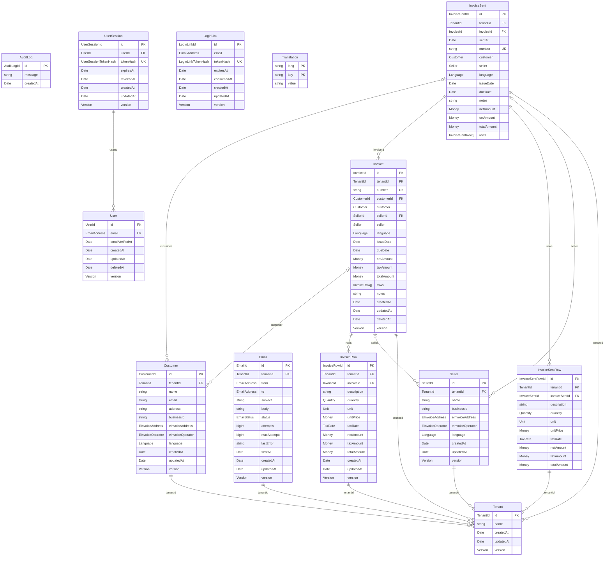

# Spec

```mermaid
%% Generated by scripts/spec/generate-mermaid-spec.ts. Do not edit.
erDiagram
    AuditLog {
        AuditLogId id PK
        string message
        Date createdAt
    }

    Customer {
        CustomerId id PK
        TenantId tenantId FK
        string name
        string email
        string address
        string businessId
        EInvoiceAddress eInvoiceAddress
        EInvoiceOperator eInvoiceOperator
        Language language
        Date createdAt
        Date updatedAt
        Version version
    }

    Email {
        EmailId id PK
        TenantId tenantId FK
        EmailAddress from
        EmailAddress to
        string subject
        string body
        EmailStatus status
        bigint attempts
        bigint maxAttempts
        string lastError
        Date sentAt
        Date createdAt
        Date updatedAt
        Version version
    }

    Invoice {
        InvoiceId id PK
        TenantId tenantId FK
        string number UK
        CustomerId customerId FK
        Customer customer
        SellerId sellerId FK
        Seller seller
        Language language
        Date issueDate
        Date dueDate
        Money netAmount
        Money taxAmount
        Money totalAmount
        InvoiceRow[] rows
        string notes
        Date createdAt
        Date updatedAt
        Date deletedAt
        Version version
    }

    InvoiceRow {
        InvoiceRowId id PK
        TenantId tenantId FK
        InvoiceId invoiceId FK
        string description
        Quantity quantity
        Unit unit
        Money unitPrice
        TaxRate taxRate
        Money netAmount
        Money taxAmount
        Money totalAmount
        Date createdAt
        Date updatedAt
        Version version
    }

    InvoiceSent {
        InvoiceSentId id PK
        TenantId tenantId FK
        InvoiceId invoiceId FK
        Date sentAt
        string number UK
        Customer customer
        Seller seller
        Language language
        Date issueDate
        Date dueDate
        string notes
        Money netAmount
        Money taxAmount
        Money totalAmount
        InvoiceSentRow[] rows
    }

    InvoiceSentRow {
        InvoiceSentRowId id PK
        TenantId tenantId FK
        InvoiceSentId invoiceSentId FK
        string description
        Quantity quantity
        Unit unit
        Money unitPrice
        TaxRate taxRate
        Money netAmount
        Money taxAmount
        Money totalAmount
    }

    LoginLink {
        LoginLinkId id PK
        EmailAddress email
        LoginLinkTokenHash tokenHash UK
        Date expiresAt
        Date consumedAt
        Date createdAt
        Date updatedAt
        Version version
    }

    Seller {
        SellerId id PK
        TenantId tenantId FK
        string name
        string businessId
        EInvoiceAddress eInvoiceAddress
        EInvoiceOperator eInvoiceOperator
        Language language
        Date createdAt
        Date updatedAt
        Version version
    }

    Tenant {
        TenantId id PK
        string name
        Date createdAt
        Date updatedAt
        Version version
    }

    Translation {
        string lang PK
        string key PK
        string value
    }

    User {
        UserId id PK
        EmailAddress email UK
        Date emailVerifiedAt
        Date createdAt
        Date updatedAt
        Date deletedAt
        Version version
    }

    UserSession {
        UserSessionId id PK
        UserId userId FK
        UserSessionTokenHash tokenHash UK
        Date expiresAt
        Date revokedAt
        Date createdAt
        Date updatedAt
        Version version
    }

    Customer ||--o{ Tenant : "tenantId"
    Email ||--o{ Tenant : "tenantId"
    Invoice |o--o{ Customer : "customer"
    Invoice ||--o{ InvoiceRow : "rows"
    Invoice |o--o{ Seller : "seller"
    Invoice ||--o{ Tenant : "tenantId"
    InvoiceRow ||--o{ Tenant : "tenantId"
    InvoiceSent |o--o{ Customer : "customer"
    InvoiceSent ||--o{ Invoice : "invoiceId"
    InvoiceSent ||--o{ InvoiceSentRow : "rows"
    InvoiceSent |o--o{ Seller : "seller"
    InvoiceSent ||--o{ Tenant : "tenantId"
    InvoiceSentRow ||--o{ Tenant : "tenantId"
    Seller ||--o{ Tenant : "tenantId"
    UserSession ||--o{ User : "userId"
```
